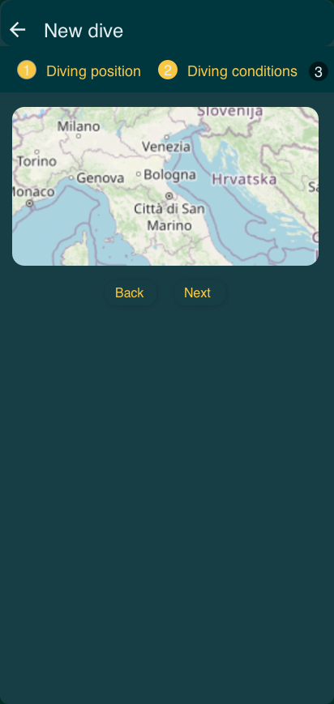

Sea Sentinels

Sea Sentinels is a Flutter application designed to assist divers in recording and managing their underwater explorations while contributing to marine biodiversity research. The app allows users to log dive details, track marine species sightings, and share this data with the Department of Biology at the University of Bologna to support studies on the effectiveness of marine biodiversity projects. Through features like interactive mapping, species collection tracking, and comprehensive dive summaries, Sea Sentinels empowers users to engage in citizen science and contribute valuable data for environmental monitoring. 

This README provides mockups of the app and detailed instructions on how to set up and run the application on your local machine.

## Application mockups


### 1. Authentication and Profile
<p align="center">
  
  
  
  
</p>
<p align="center">
  
  **Sign Up and Login:** Access and registration to the app.  
  **User Profile:** Viewing personal information.  
  **Change Password:** Form to update the password.
</p>

---

### 2. Home and Dive Details
<p align="center">
  
  
</p>
<p align="center">
  
  **Home:** Interactive map with dive markers.  
  **Dive Details:** In-depth information viewable by clicking on the markers.
</p>

---

### 3. Marine Species Collection
<p align="center">
  
  
  
</p>
<p align="center">
  
  **Collection:** List of sighted marine species.  
  **Species Details:** Specific information about each species.  
  **Wikipedia:** Link to the external information page.
</p>

---

### 4. New Dive Questionnaire
<p align="center">
  
  
  
  
  
</p>
<p align="center">
  
  **Page 1:** Select the position via an interactive map.  
  **Page 2:** Enter dive data.  
  **Page 3:** Choose the sighted species, similar to the Collection page.  
  **Page 4:** Select the quantity for each species.  
  **Page 5:** Complete summary of the entered data.
</p>


## Setup
Prerequisites
Before you begin, ensure you have the following installed on your system:

1. Flutter SDK: This project requires Flutter version 3.3.1 or higher. If you haven't installed Flutter yet, follow the official Flutter installation guide.				2.Dart SDK: The project uses Dart SDK version 3.3.1 or higher. This should be included with your Flutter installation
3. Git: You'll need Git to clone the repository. Download and install it from git-scm.com.
4. Android Studio or Visual Studio Code: For debugging and running the application. Install your preferred IDE:

   - Android Studio
   - Visual Studio Code with the Flutter and Dart plugins


6. Android Emulator or iOS Simulator: To run the app on a virtual device.

**Installation Steps**

Follow these steps to set up the project on your local machine:

1. **Clone the repository** 
Open a terminal and run the following command:

```gitCopy
clone https://github.com/[your-username]/sea_sentinels.git
```

Replace [your-username] with your actual GitHub username.

2. **Navigate to the project directory**
```
cd sea_sentinels
```

3. **Install dependencies**
   
Run the following command to fetch all the required packages:
```
flutter pub get
```
This command reads the pubspec.yaml file and installs all the listed dependencies.

4. **Configure Firebase (if applicable)**
   This project uses Firebase for authentication and cloud storage. You need to set up your own Firebase project with your API keys and add the configuration files:

      - For Android: Download the `google-services.json` file and place it in the *android/app/ directory*.
      - For iOS: Download the `GoogleService-Info.plist` file and place it in the _ios/Runner/ directory_.

FlutterFire CLI is a command-line tool that helps you set up Firebase in your Flutter projects: https://firebase.flutter.dev/

After installing the FlutterFire CLI, run the following command to set up Firebase in your project:

```
flutterfire configure
```

Refer to the Firebase Flutter setup guide for further instructions.

If you don't want to connetc to an external Database, you can change the class called by the repository provider:

- In the *lib/repositories/fish_repository_provider.dart* you just have to change (in line n.13) the call to `FirebaseFishRepository(ref)` with `LocalFishRepository(ref)`.

- The same has to be done in *lib/repositories/diving_repository_provider.dart*, changing (in line n.12) the call to `FirebaseDivingRepository(ref)` with `LocalDivingRepository(ref)`.

5. __Don't run code generators__

For your information, this project used code generation for some packages (freezed, json_serializable, and riverpod_generator), with this command:
```
flutter pub run build_runner build --delete-conflicting-outputs
```
**You don't need to run them, since they were created and then customized for the project's aims, and running again this command will ovrewrite these files and it will create files with undesired behaviours**


**Running the Application**
   
Now that you've set up the project, you can run the application:

  1. Start an emulator or connect a physical device
     You can start an Android emulator from Android Studio or an iOS simulator from Xcode.
     
     In Android Studio use Google Pixel 7 or above
     
  2. Run the app
     
     In the terminal, run:

      ```
      flutter run -d <name-of-your-emulator>
      ```
    
     This command will build the app and install it on your emulator or connected device.


**Troubleshooting**

If you encounter any issues during setup or running the app, try the following:

  1. Ensure all dependencies are up to date:

  ```
  flutter pub upgrade
  ```

  2. Or clean the project and rebuild:

  ```
  flutter clean
  flutter pub get
  flutter run -d <name-of-your-emulator>
  ```

Furthermore, you can check that your Flutter installation is correct:

```
flutter doctor
```

This command will show you any issues with your Flutter setup.Sea Sentinels

Sea Sentinels is a Flutter application designed to assist divers in recording and managing their underwater explorations while contributing to marine biodiversity research. The app allows users to log dive details, track marine species sightings, and share this data with the Department of Biology at the University of Bologna to support studies on the effectiveness of marine biodiversity projects. Through features like interactive mapping, species collection tracking, and comprehensive dive summaries, Sea Sentinels empowers users to engage in citizen science and contribute valuable data for environmental monitoring. 

This README provides mockups of the app and detailed instructions on how to set up and run the application on your local machine.

## Application mockups


### 1. Authentication and Profile
<p align="center">
  
  
  
  
</p>
<p align="center">
  **Sign Up and Login:** Access and registration to the app.  
  **User Profile:** Viewing personal information.  
  **Change Password:** Form to update the password.
</p>

---

### 2. Home and Dive Details
<p align="center">
  
  
</p>
<p align="center">
  **Home:** Interactive map with dive markers.  
  **Dive Details:** In-depth information viewable by clicking on the markers.
</p>

---

### 3. Marine Species Collection
<p align="center">
  
  
  
</p>
<p align="center">
  **Collection:** List of sighted marine species.  
  **Species Details:** Specific information about each species.  
  **Wikipedia:** Link to the external information page.
</p>

---

### 4. New Dive Questionnaire
<p align="center">
  
  
  
  
  
</p>
<p align="center">
  **Page 1:** Select the position via an interactive map.  
  **Page 2:** Enter dive data.  
  **Page 3:** Choose the sighted species, similar to the Collection page.  
  **Page 4:** Select the quantity for each species.  
  **Page 5:** Complete summary of the entered data.
</p>


**Setup**
Prerequisites
Before you begin, ensure you have the following installed on your system:

1. Flutter SDK: This project requires Flutter version 3.3.1 or higher. If you haven't installed Flutter yet, follow the official Flutter installation guide.				2.Dart SDK: The project uses Dart SDK version 3.3.1 or higher. This should be included with your Flutter installation
3. Git: You'll need Git to clone the repository. Download and install it from git-scm.com.
4. Android Studio or Visual Studio Code: For debugging and running the application. Install your preferred IDE:

   - Android Studio
   - Visual Studio Code with the Flutter and Dart plugins


6. Android Emulator or iOS Simulator: To run the app on a virtual device.

**Installation Steps**

Follow these steps to set up the project on your local machine:

1. **Clone the repository** 
Open a terminal and run the following command:

```gitCopy
clone https://github.com/[your-username]/sea_sentinels.git
```

Replace [your-username] with your actual GitHub username.

2. **Navigate to the project directory**
```
cd sea_sentinels
```

3. **Install dependencies**
   
Run the following command to fetch all the required packages:
```
flutter pub get
```
This command reads the pubspec.yaml file and installs all the listed dependencies.

4. **Configure Firebase (if applicable)**
   This project uses Firebase for authentication and cloud storage. You need to set up your own Firebase project with your API keys and add the configuration files:

      - For Android: Download the `google-services.json` file and place it in the *android/app/ directory*.
      - For iOS: Download the `GoogleService-Info.plist` file and place it in the _ios/Runner/ directory_.

FlutterFire CLI is a command-line tool that helps you set up Firebase in your Flutter projects: https://firebase.flutter.dev/

After installing the FlutterFire CLI, run the following command to set up Firebase in your project:

```
flutterfire configure
```

Refer to the Firebase Flutter setup guide for further instructions.

If you don't want to connetc to an external Database, you can change the class called by the repository provider:

- In the *lib/repositories/fish_repository_provider.dart* you just have to change (in line n.13) the call to `FirebaseFishRepository(ref)` with `LocalFishRepository(ref)`.

- The same has to be done in *lib/repositories/diving_repository_provider.dart*, changing (in line n.12) the call to `FirebaseDivingRepository(ref)` with `LocalDivingRepository(ref)`.

5. __Don't run code generators__

For your information, this project used code generation for some packages (freezed, json_serializable, and riverpod_generator), with this command:
```
flutter pub run build_runner build --delete-conflicting-outputs
```
**You don't need to run them, since they were created and then customized for the project's aims, and running again this command will ovrewrite these files and it will create files with undesired behaviours**


**Running the Application**
   
Now that you've set up the project, you can run the application:

  1. Start an emulator or connect a physical device
     You can start an Android emulator from Android Studio or an iOS simulator from Xcode.
     
     In Android Studio use Google Pixel 7 or above
     
  2. Run the app
     
     In the terminal, run:

      ```
      flutter run -d <name-of-your-emulator>
      ```
    
     This command will build the app and install it on your emulator or connected device.


**Troubleshooting**

If you encounter any issues during setup or running the app, try the following:

  1. Ensure all dependencies are up to date:

  ```
  flutter pub upgrade
  ```

  2. Or clean the project and rebuild:

  ```
  flutter clean
  flutter pub get
  flutter run -d <name-of-your-emulator>
  ```

Furthermore, you can check that your Flutter installation is correct:

```
flutter doctor
```

This command will show you any issues with your Flutter setup.
